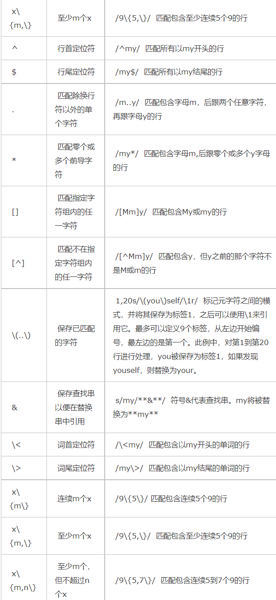

# sed
sed编辑器逐行处理文件（或输入），并将结果发送到屏幕。先把当前处理的行保存在临时缓存区中（也称为模式空间），处理完成后把该行发送到屏幕。
[参考博客：sed的使用](https://www.cnblogs.com/edwardlost/archive/2010/09/17/1829145.html) 

[[001文件系统|返回001文件系统]]
   格式：sed [-n|-e|-f] '[...]' filename
   ## 选项：
   ```shell
    -e #进行多项编辑，即对输入行应用多条sed命令时使用
   ```
   ```shell
    
    -n  #sed默认将修改过的文件全部显示，-n取消默认的输出
   ```
   ```shell
    -f #指定sed脚本的文件名
   ```
## sed操作命令
	demo1.txt
   ```shell
	qiaotao
	lzf
	chengpingan
	linyao
	xufengnian
	jiangni
	lvshu
	renxiaosu
	yangxiaojing

   ```
	
	demo2.txt
  ```shell
	SB
  ```
___
```shell
	p命令	#显示修改过的模式空间的内容
	sed '/lzf/p' demo1.txt
	#lzf会显示两次
	sed -n '/lzf/p' demo1.txt
	#只显示lzf，-n取消了默认输出
  ```
___
  ```shell
	d命令 #删除当前行，此行不显示
	sed '/lzf/d' demo1.txt
	#删除lzf,显示后屏幕上没有lzf
  ```
___
  ```shell
	s命令 #将所选字符替换
	sed 's/zf/fff/g' demo1.txt
	#把lzf换成lfff，最后的g表示全局？（好像不影		  响结果）,/可以换成其他字符（除了换行和\）
  ```
___
  ```shell
	r命令	#sed使用该命令将一个文本文件中的内容加到当前文件的特定位置上。
	sed '/lzf/r demo2.txt' demo1.txt
	#在lzf的后一行加上SB，如果有多个lzf，每个后都加SB
  ```
___
  ```shell
	w命令 #将所选的行写入文件
	sed '/lzf/w demo2.txt' demo1.txt
	#将lzf写到demo2.txt文件，demo.txt原本的内容被覆盖
  ```
___
  ```shell
	a\命令 #在当前行后面追加内容，如果要追加的内容超过一行，则每一行都必须以反斜线结束，最后一行除外。最后一行将以引号和文件名结束。
	sed '/lzf/a\
	> lll\
	> zzz\' demo1.txt
	#在lzf后加入lll和zzz两行
  ```
___
  ```shell
	i\命令 #在当前行前插入内容
  ```
___
  ```shell
	c\命令 #将模式空间中内容修改成新的文本
	sed 'c\     
	123' demo1.txt
	#将每一行都换成123
  ```
___
  ```shell
	n命令 #获取当前行的下一行
	sed '/lzf/{n;p;}' demo1.txt -n
	#显示lzf的后面一行chengpingan
	sed '/lzf/{n;s/cheng/li/;}' demo1.txt
	#chengpingan变成lipingan，s/cheng/li/只作用与lzf后面一行
  ```
___
  ```shell
	y命令 该命令与UNIX/Linux中的tr命令类似，字符按照一对一的方式从左到右进行转换。例如，y/abc/ABC/将把所有小写的a转换成A，小写的b转换成B，小写的c转换成C。
	sed 'y/lizf/1234/' demo1.txt
	sed '1,20y/hrwang12/HRWANG^$/' datafile  
	#将1到20行内，所有的小写hrwang转换成大写，将1转换成^,将2转换成$。
	#正则表达式元字符对y命令不起作用。与s命令的分隔符一样，斜线可以被替换成其它的字符。
  ```
___
  ```shell
	q命令 #导致sed程序退出，不再进行其它的处理。
	sed '/lzf/{s/lzf/lll/;q;}' demo1.txt
	#显示到第一个lzf就停止，lzf被换成lll
  ```
___
  ```shell
	h命令和g命令
	#cat datafile
	#My name is hrwang.
	#Your name 	is mjfan.
	#hrwang is mjfan's husband.
	#mjfan is hrwang's wife.
	
	sed -e '/hrwang/h' -e '$G' datafile
	sed -e '/hrwang/H' -e '$G' datafile
	#通过上面两条命令，你会发现h会把原来暂存缓冲区的内容清除，只保存最近一次执行h时保存				进去的模式空间的内容。而H命令则把每次匹配hrwnag的行都追加保存在暂存缓冲区。  
	sed -e '/hrwang/H' -e '$g' datafile
	sed -e '/hrwang/H' -e '$G' datafile
	#通过上面两条命令，你会发现g把暂存缓冲区中的内容替换掉了模式空间中当前行的内容，此处	即替换了最后一行。而G命令则把暂存缓冲区的内容追加到了模式空间的当前行后。此处即追加到了末尾。
  ```
___
  ```shell
	整形定位
	sed -n '3p' datafile  
	#只打印第三行, 其中的p时显示命令
  ```
___
  ```
		注：如果需要使用多条命令，或者需要在某个地址范围内嵌套地址，就必须用花括号将命令括	起来，每行只写一条命令，或这用分号分割同一行中的多条命令。
  ```

## sed脚本
  ```
  	sed脚本就是写在文件中的一列sed命令。脚本中，要求命令的末尾不能有任何多余的空格或文	本。如果在一行中有多个命令，要用分号分隔。执行脚本时，sed先将输入文件中第一行复制到模式缓冲区，然后对其执行脚本中所有的命令。每一行处理完毕后，sed再复制文件中下一行到模式缓冲区，对其执行脚本中所有命令。使用sed脚本时，不再用引号来确保sed命令不被shell解释。例如sed脚本script：
  ```
  ```shell
  
  	#handle datafile  
	3i\  
	~~~~~~~~~~~~~~~~~~~~~  
	3,$s/\(hrwang\) is` `\(mjfan\)/\2 is \1/	
	$a\  
	We will love eachother forever！！
  
  ```
  ```shell
  	#sed -f script datafile  
	My name is hrwang  
	Your name is mjfan  
	~~~~~~~~~~~~~~~~~~~~~  
	mjfan is hrwang's husband.          ＃啦啦～～～  
	mjfan is hrwang's wife.  
	We will love eachother forever！！
  ```

## 正则表达式元字符

 与grep一样，sed也支持特殊元字符，来进行模式查找、替换。不同的是，sed使用的正则表达式是括在斜杠线"/"之间的模式。

如果要把正则表达式分隔符"/"改为另一个字符，比如o，只要在这个字符前加一个反斜线，在字符后跟上正则表达式，再跟上这个字符即可。例如：sed -n '\o^Myop' datafile


